# Housing Financial Vulnerability Score (HFVS) & Allocation Decision Tool

> **Strathmore University MSc in Data Science and Analytics Dissertation Project**  
> **Author**: Valerie Jerono Kiprop (Sephine) | **Registration No**: 222331  
> **Supervisor**: Dr. Titus Orwa | **Research Centre**: iLabAfrica Research Centre, Strathmore Institute of Mathematical Sciences  
> **Dissertation Title**: *Sh73 Billion Collected, 1,795 Homes Built: Chaining Vulnerability, Efficiency, and Allocation in Kenya's Affordable Housing Programme*  
> **Deployment Target**: Stakeholder Decision-Support Application (Vercel Serverless + Static Glassmorphic UI)

---

## Executive Summary & CRISP-DM Storytelling

The **Housing Financial Vulnerability Score (HFVS)** decision-support tool is an end-to-end data science and econometric pipeline that operationalises household financial vulnerability, benchmarks county-level housing delivery efficiency, and optimises statutory Housing Levy allocations across Kenya's 47 devolved counties.

This project follows the **CRISP-DM (Cross-Industry Standard Process for Data Mining)** methodology across seven structured phases, spanning business understanding, data auditing, multi-tier machine learning, non-radial efficiency benchmarking, mathematical optimization, and serverless application deployment.

```
+---------------------------------------------------------------------------------------------------+
|                                      CRISP-DM METHODOLOGY FLOW                                    |
+---------------------------------------------------------------------------------------------------+
|  1. Business Understanding   --> Fiscal Reality vs Delivery Capacity Ceiling Bottleneck            |
|  2. Data Understanding       --> Kenya Housing Survey (21,347 Households, 47 Counties)             |
|  3. Data Preparation         --> 5-Pillar HFVS Construction, GroupKFold Leakage Prevention        |
|  4. Modeling & Benchmarking  --> Tier 1 Hurdle ML (R²=0.617), Tier 2 SBM DEA (ρ=0.798), Tier 3 MILP  |
|  5. Evaluation & Diagnostics --> Spatial CV Gap, Equity Fan Charts, Binding Capacity Diagnosis    |
|  6. Deployment Architecture  --> Vercel Serverless + DuckDB-WASM Microdata + Groq RAG AI Analyst  |
|  7. Recommendations          --> Option C Capacity Uplift & National Housing Policy Action        |
+---------------------------------------------------------------------------------------------------+
```

---

## Phase 1: Business Understanding

### 1.1 The Policy Bottleneck: Money vs Delivery Capacity
In FY2024/25, the Kenya Revenue Authority collected **KSh 73.2 Billion** in statutory Housing Levy receipts under the *Affordable Housing Act, 2024*, exceeding the National Treasury's target of KSh 63.2 Billion (115.8% collection rate). Cumulative collections since 2024 exceed KSh 170 Billion.

However, in the same review period, only **1,795 housing units were completed nationally**, against the official annual target of 200,000 units per year. Furthermore, official Treasury reports tabled in Parliament confirmed that **over KSh 30 Billion of collected proceeds remained undisbursed in Treasury bills** rather than being deployed into housing construction.

```
+---------------------------------------------------------------------------------------------------+
|                                FISCAL REALITY VS PHYSICAL DELIVERY                                |
+---------------------------------------------------------------------------------------------------+
|  Statutory Housing Levy Collection (FY2024/25) : KSh 73.20 Billion (115.8% of Treasury Target)     |
|  Undisbursed Revenue Resting in Treasury Bills   : KSh 30.00+ Billion                              |
|  Actual Completed Housing Units (FY2024/25)    : 1,795 Units (<1% of 200,000 Target)               |
|  Primary Policy Finding                          : DELIVERY CAPACITY CEILING IS THE BOTTLENECK    |
+---------------------------------------------------------------------------------------------------+
```

### 1.2 Research Objectives (RO1 - RO4)
1. **RO1 (Household Vulnerability & ML Prediction)**: Formulate a 5-pillar composite Housing Financial Vulnerability Score (HFVS) and train a spatially cross-validated, leakage-audited two-stage machine learning hurdle architecture to predict cost burden intensity and default risk.
2. **RO2 (County Efficiency Benchmarking)**: Benchmark all 47 devolved counties on housing execution efficiency using non-radial Data Envelopment Analysis (SBM DEA), quantifying hidden operational slacks in water travel time and room overcrowding.
3. **RO3 (MILP Allocation Optimization)**: Formulate a Mixed-Integer Linear Programming (MILP) model to optimize unit quotas and financial capital allocation across three policy regimes under real municipal capacity, budget, and unit cap constraints.
4. **RO4 (Decision-Support Deployment)**: Build and deploy an interactive decision-support web application for policymakers with zero-hallucination Groq-powered RAG AI analyst support.

---

## Phase 2: Data Understanding

### 2.1 Survey Spine & Sample Architecture
The empirical spine of this research is the **Kenya Housing Survey 2023/24 (KHS)**, encompassing **21,347 households across all 47 devolved counties**, joined across six thematic modules: household demographics, dwelling characteristics, land tenure, financial expenditure, county infrastructure, and municipal governance.

| Survey Dimension | Empirical Metric / Sample Share |
|---|---|
| **Total Households Surveyed** | 21,347 households |
| **Devolved County Coverage** | 47 out of 47 counties (100% national coverage) |
| **Housing Tenure Profile** | 61.5% Owner-Occupiers (13,118 hh) \| 32.5% Renters (6,938 hh) |
| **Settlement Environment** | 44.3% Urban Households \| 55.7% Rural Households |
| **Headship Gender Profile** | 31.9% Female-Headed Households \| 68.1% Male-Headed Households |
| **Income Brackets (KNBS)** | 4 Income Brackets (<KSh 20k, KSh 20k-49.9k, KSh 50k-149.9k, >=KSh 150k) |

### 2.2 Exploratory Data Analysis & Variable Audits

#### Missingness Tiers
An initial audit of 540 raw variables identified structural missingness patterns resulting from survey skip routing (e.g. rent expenditure skips for owner-occupiers). 112 variables exceeded 80% missingness and were safely isolated, while 126 core variables exhibited 100% complete records.

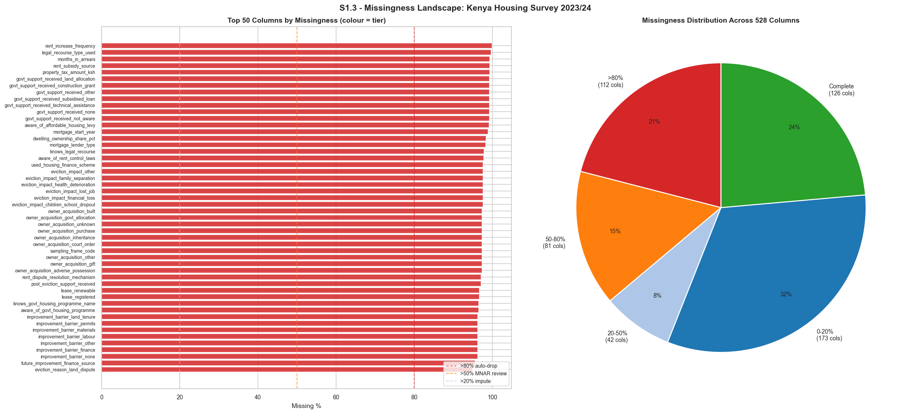

#### Demographic & Socioeconomic Profiles
Exploratory distribution plots highlight structural dualities between urban tenant populations facing heavy financial stress and rural owner-occupier populations facing severe utility and tenure insecurity deficits.

| Demographic Profile | Dwelling & Tenure Profile |
|---|---|
| 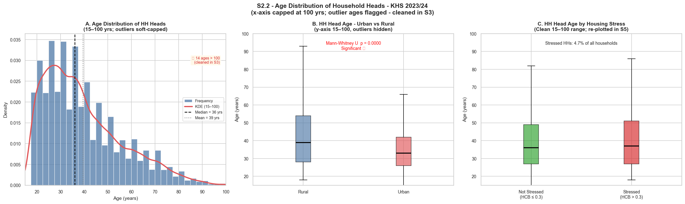 | 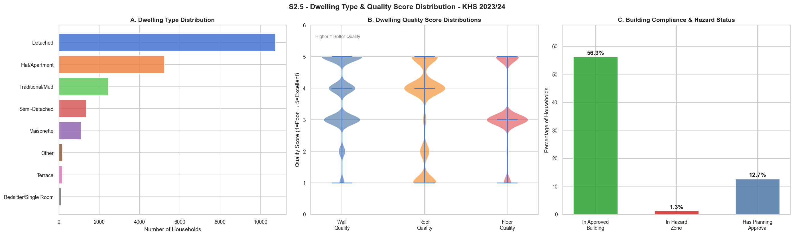 |
| 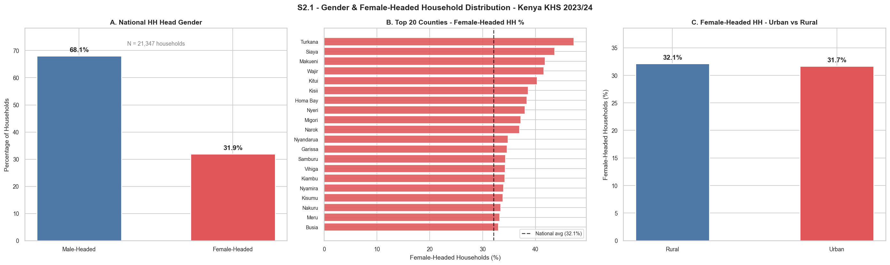 | 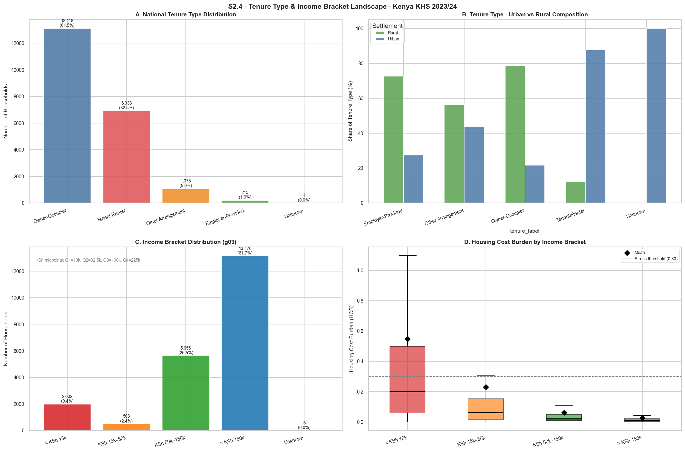 |

#### Urban-Rural Settlement Split
Urban households exhibit higher financial stress ratios (rent-to-income), whereas rural households record higher physical dwelling and utility deprivation scores.

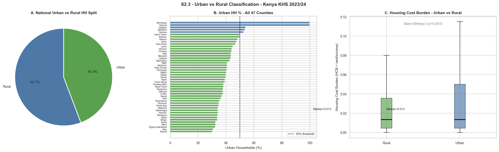

---

## Phase 3: Data Preparation

### 3.1 Data Cleaning & Variable Selection
The raw survey dataset was filtered from 540 variables down to **446 audit-clean variables**, preserving all 21,347 household records without dropping a single observation. Outlier audits identified extreme non-linear rent expenditure values, which were Winsorised at the 99th percentile.

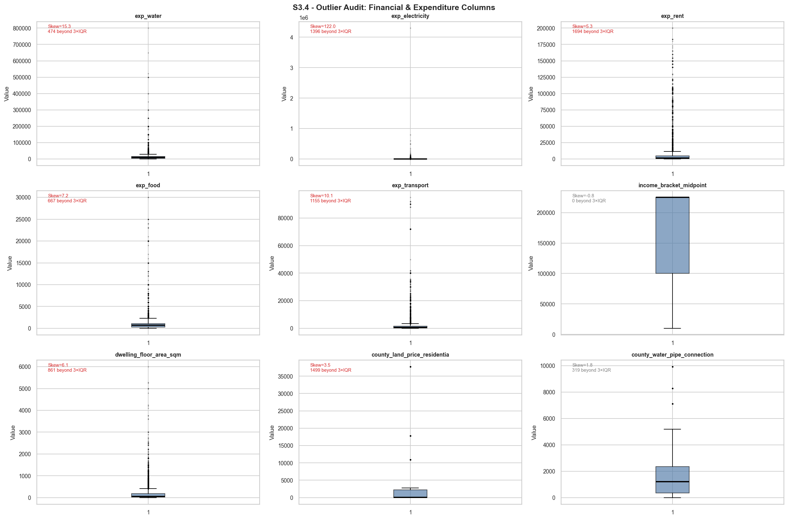

### 3.2 Construction of the 5-Pillar HFVS Composite Score
The **Housing Financial Vulnerability Score (HFVS)** is built as an empirically weighted multi-criteria index across five vulnerability dimensions (D1 to D5). Pillar weights ($\beta$) were derived using SHAP (SHapley Additive exPlanations) attribution from the machine learning pipeline:

$$\text{HFVS}_i = \sum_{k=1}^{5} \beta_k \cdot D_{ki} = 0.241 D_{1i} + 0.352 D_{2i} + 0.129 D_{3i} + 0.179 D_{4i} + 0.099 D_{5i}$$

```
+---------------------------------------------------------------------------------------------------+
|                                  HFVS FIVE VULNERABILITY PILLARS                                  |
+---------------------------------------------------------------------------------------------------+
|  D1: Financial Stress (Weight: 24.1%)    --> Income bracket, rent burden ratio, budget deficit   |
|  D2: Tenure Insecurity (Weight: 35.2%)   --> Lease status, informal structure, eviction risk    |
|  D3: Physical Hazard (Weight: 12.9%)     --> Periodic flood exposure, site drainage, hazard     |
|  D4: Dwelling Quality (Weight: 17.9%)    --> Wall/roof/floor materials, room overcrowding ratio |
|  D5: Utility Deprivation (Weight: 9.9%)  --> Unpiped water, poor sanitation, power reliability  |
+---------------------------------------------------------------------------------------------------+
```

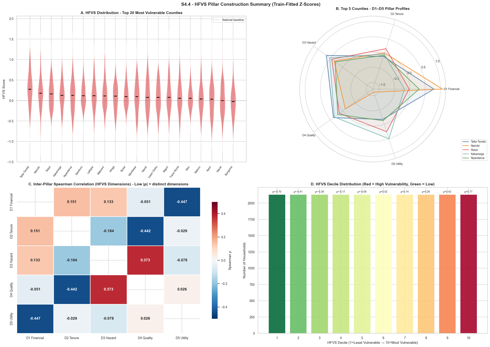

#### Correlation Family Analysis
Inter-pillar correlation audits confirmed low multi-collinearity across the five dimensions (maximum pairwise correlation $r = 0.469$), ensuring each pillar captures distinct risk information.

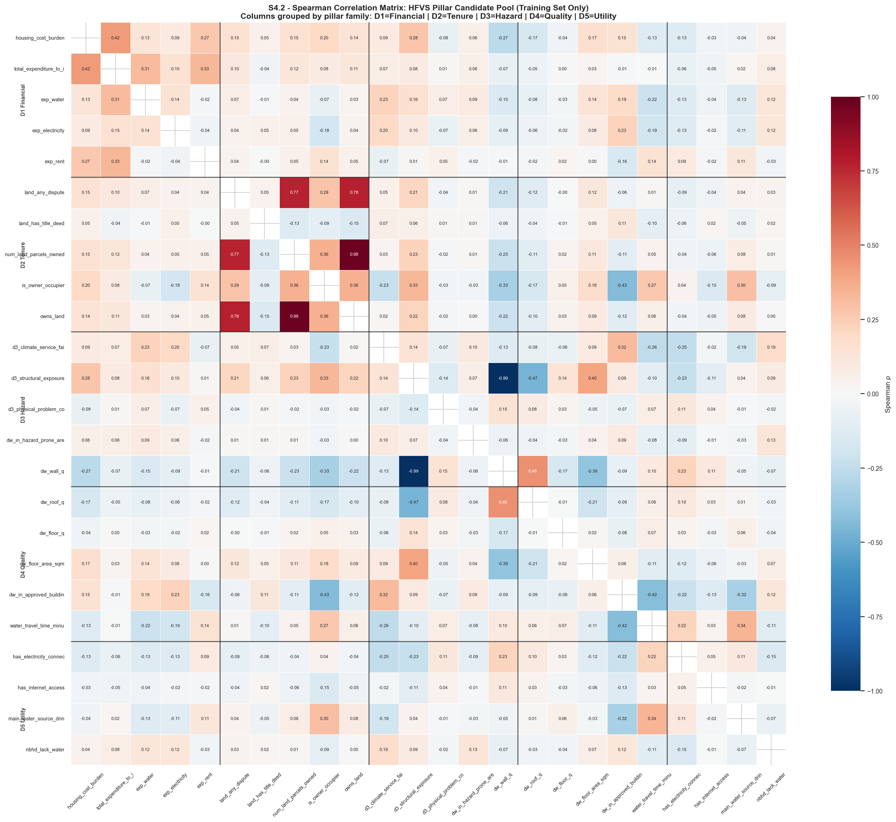

### 3.3 County Baseline Rankings & Categorical Tiers
Households are classified into four HFVS vulnerability tiers: **Low** ($\text{HFVS} < 0.30$), **Moderate** ($0.30 \le \text{HFVS} < 0.45$), **High** ($0.45 \le \text{HFVS} < 0.55$), and **Critical** ($\text{HFVS} \ge 0.55$).

| County Ranking & Categorical Audits |
|---|
| 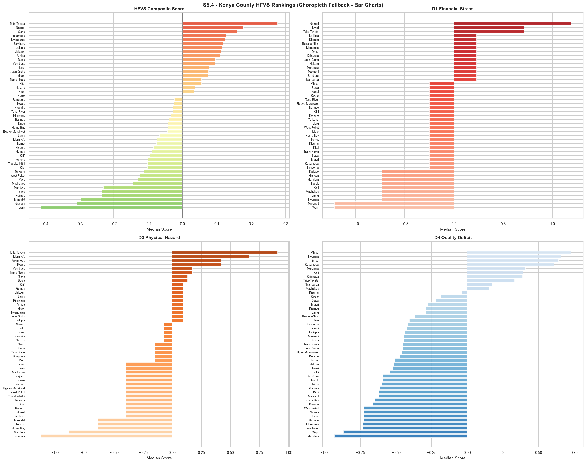 |
| 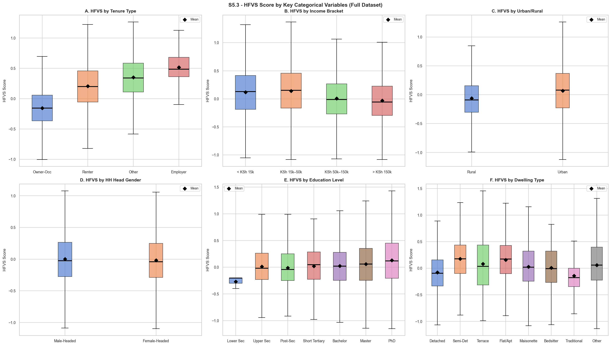 |
| 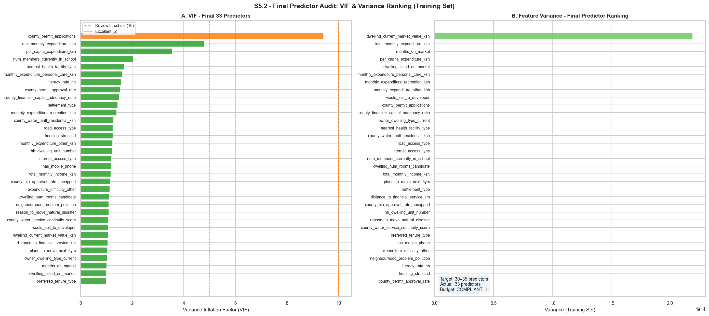 |

---

## Phase 4: Modeling & Empirical Architecture

### 4.1 Tier 1: Household Machine Learning Architecture
To predict housing cost burden and identify high-risk default households without data leakage, an 8-stage model progression chain was evaluated using 5-fold spatial `GroupKFold` cross-validation grouped by county.

```
+---------------------------------------------------------------------------------------------------+
|                                TIER 1 MODEL PROGRESSION CHAIN (R²)                                |
+---------------------------------------------------------------------------------------------------+
|  1. Baseline Linear Regression        : R² = 0.2285 (22.9% variation explained)                   |
|  2. Standard LightGBM Regressor       : R² = 0.5923 (59.2% variation explained)                   |
|  3. Standard XGBoost Regressor        : R² = 0.5889 (58.9% variation explained)                   |
|  4. Tuned LightGBM Regressor          : R² = 0.5878 (58.8% variation explained)                   |
|  5. Stacking Ensemble Architecture    : R² = 0.6020 (60.2% variation explained)                   |
|  6. Two-Stage Hurdle Renter Submodel  : R² = 0.6172 (61.7% variation explained - CHAMPION MODEL)   |
+---------------------------------------------------------------------------------------------------+
```

#### Two-Stage Hurdle Model Architecture
- **Stage 1 (Top Decile Default Risk Classifier)**: Predicts the binary onset of severe default risk ($\text{HFVS} \ge 0.55$). Achieves **ROC-AUC = 0.8865**, PR-AUC = 0.6008, and **Recall = 72.0%** at optimal threshold $p^* = 0.160$.
- **Stage 2 (Renter Cost Burden Regressor)**: Predicts cost burden intensity among vulnerable renters, achieving **$R^2 = 0.6172$** (61.7% variation explained) with a Mean Absolute Error (MAE) of **4.61%**.

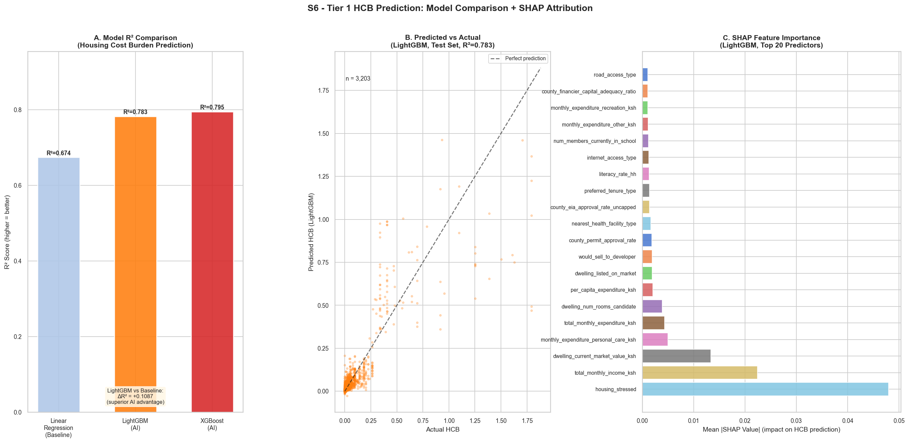

#### Primary SHAP Feature Attributions
SHAP attribution analysis reveals that **household income bracket** is the single largest predictor of housing vulnerability (mean $| \text{SHAP} | = 0.0517$), followed by **dwelling tenure status** ($| \text{SHAP} | = 0.0211$) and **monthly water expenditure** ($| \text{SHAP} | = 0.0100$).

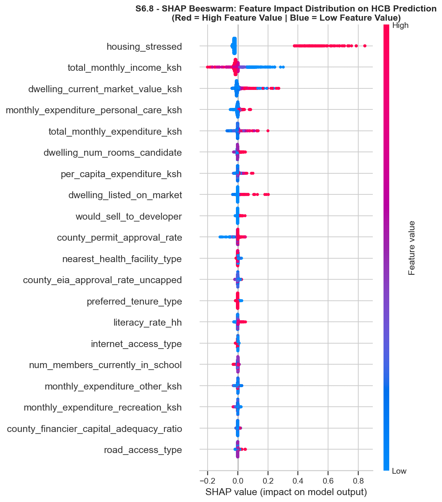

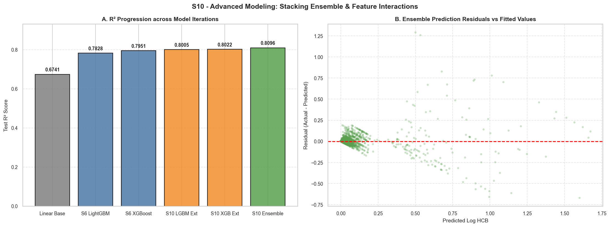

---

### 4.2 Tier 2: County Delivery Efficiency Benchmarking (Data Envelopment Analysis)
To benchmark county-level housing execution capacity, all 47 counties were evaluated using Data Envelopment Analysis (DEA). Models were formulated under Constant Returns to Scale (CCR), Variable Returns to Scale (BCC), and **Non-Radial Slack-Based Measure (SBM)**.

| DEA Efficiency Model | Mean Efficiency Score | Policy Interpretation |
|---|---|---|
| **Radial CCR Efficiency ($\theta_{CCR}$)** | **0.8062** (80.6%) | Assumes constant scale returns; masks input slacks. |
| **Radial BCC Efficiency ($\theta_{BCC}$)** | **0.8378** (83.8%) | Pure technical efficiency under variable scale returns. |
| **Non-Radial SBM Efficiency ($\rho_{SBM}$)** | **0.7975** (79.8%) | **Champion Efficiency Metric**: Exposes non-radial slacks. |
| **Radial Masking Gap** | **+0.0345** | Hidden operational slacks in water travel and overcrowding. |

```
+---------------------------------------------------------------------------------------------------+
|                                 RADIAL VS NON-RADIAL SBM BENCHMARK                               |
+---------------------------------------------------------------------------------------------------+
|  Key Finding: Radial models (CCR/BCC) overestimate county efficiency by 3.45 percentage points    |
|  because they evaluate proportional input reductions only. Non-Radial SBM uncovers hidden          |
|  operational bottlenecks in municipal water travel time (min) and room overcrowding (persons/room).|
|  Counties on Pure Technical Frontier (θ* = 1.0): 7 out of 47 counties.                            |
+---------------------------------------------------------------------------------------------------+
```

---

### 4.3 Tier 3: Mixed-Integer Linear Programming (MILP) Resource Allocation
To optimize Housing Levy disbursements, an MILP optimization model was formulated to assign housing unit quotas ($x_c$) and budget capital ($b_c$) across three distinct policy allocation regimes under real municipal capacity ceilings ($CAP_c$), levy revenue pools ($B$), and quota caps ($Q$).

$$\max \sum_{c=1}^{47} \left( \text{HFVS}_c \cdot \rho_{c} \cdot x_c \right)$$

$$\text{Subject to: } \sum_{c=1}^{47} \text{Cost}_c \cdot x_c \le B, \quad x_c \le CAP_c, \quad \sum_{c=1}^{47} x_c \le Q$$

```
+---------------------------------------------------------------------------------------------------+
|                                THREE POLICY ALLOCATION REGIMES                                    |
+---------------------------------------------------------------------------------------------------+
|  Regime A (Hub Concentration)   : Allocates 6,000 units across 26 top-capacity counties (KSh 19.75B) |
|  Regime B (Universal Equity)    : Mandates coverage across all 47 counties (6,000 units, KSh 19.75B) |
|  Option C (Capacity Uplift)     : Uplifts capacity by +50% in constrained hubs, unlocking +3,000 units |
+---------------------------------------------------------------------------------------------------+
```

#### Key Optimization Findings
1. **Universal Coverage is Free at Current Quota**: Regime B achieves 100% 47-county coverage at **exactly the same total budget cost (KSh 19.75 Billion)** as Regime A's 26-county concentration model.
2. **Levy Revenue Surplus**: The 6,000-unit programme requires KSh 19.75 Billion, leaving **KSh 53.45 Billion (73.0% of annual levy revenue) unspent**, proving that funding availability is not the constraint.
3. **Aspirational 200,000-Unit Target**: At the national 200,000-unit goal, the entire 15,365-unit high-vulnerability backlog (KSh 50.58 Billion) is **100% fundable** within one year's KSh 73.20 Billion levy collection!

| MILP Policy Dashboards & Binding Constraint Diagnostics |
|---|
| 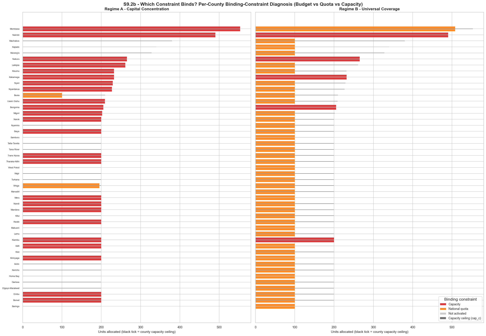 |
| 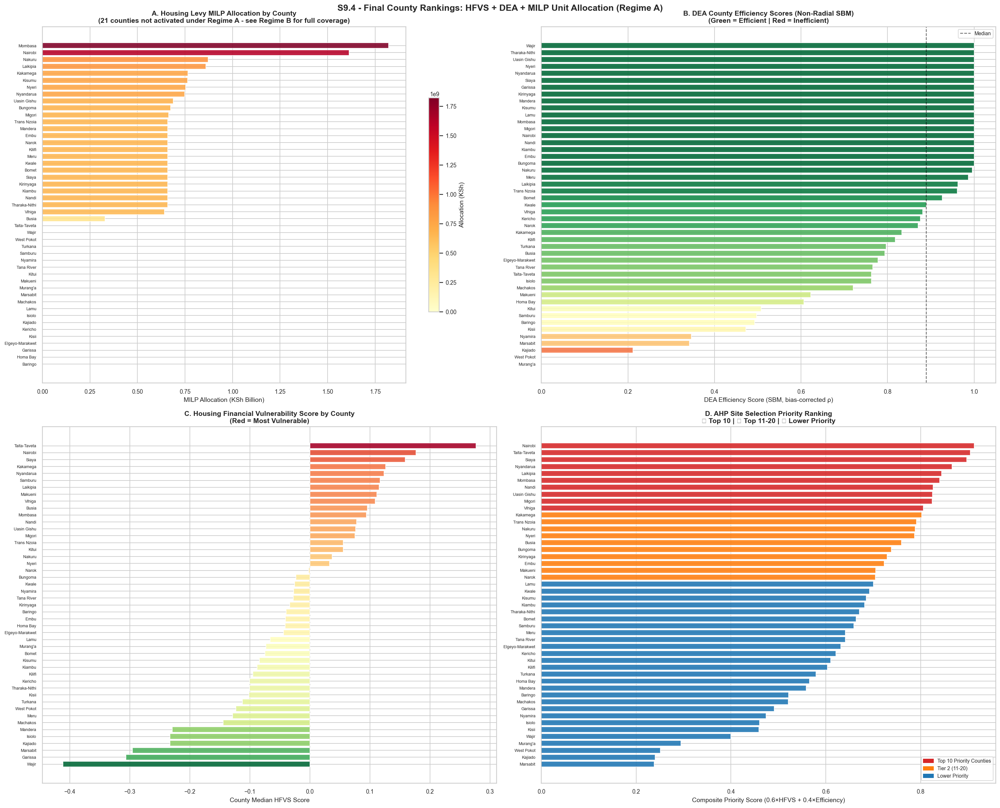 |
| 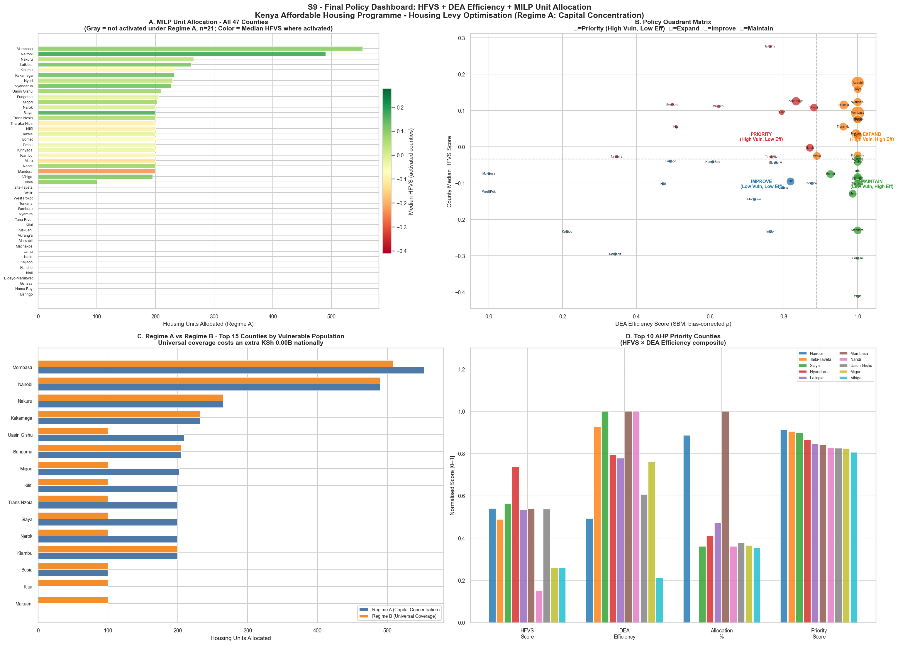 |

---

## Phase 5: Evaluation & Diagnostics

### 5.1 Spatial Generalization Gap Audit
To test model robustness across geographically unseen counties, out-of-county spatial cross-validation was conducted. The model recorded a **generalization gap penalty of 0.3614**, highlighting that spatial housing models require local county calibration to prevent geographical transfer bias.

### 5.2 Equity & Backlog Fan Charts
Lorenz curve and quantile fan chart evaluations demonstrate that allocating housing investment purely by municipal population size misallocates funds away from high-vulnerability peripheral counties.

| Equity & Quantile Audits |
|---|
| 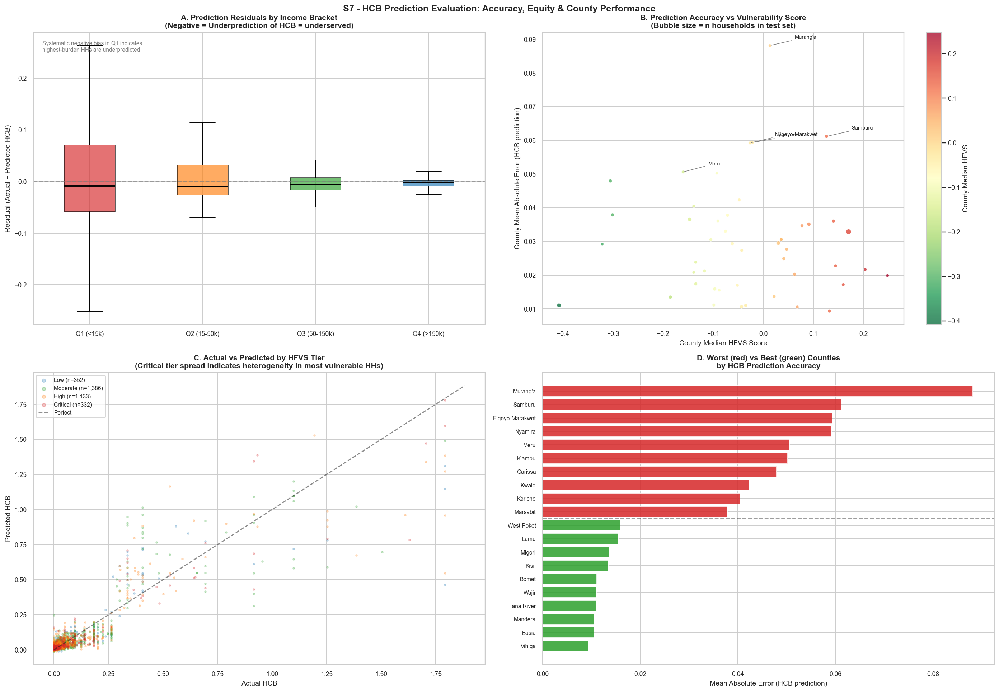 |
| 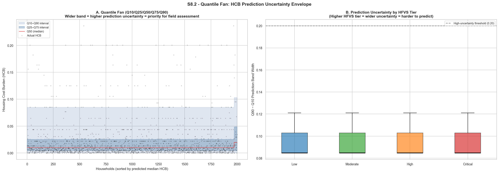 |

### 5.3 Binding Constraint Diagnosis Summary
Across Kenya's 47 counties under Regime A:
- **24 counties** are strictly constrained by local municipal **delivery capacity ceilings** (building permits, completion velocity).
- **2 counties** hit the national programme unit quota cap.
- **0 counties are constrained by financial budget limits!**

---

## Phase 6: Deployment & Software Engineering Deep Dive

### 6.1 System Architecture & Tech Stack
The decision-support web application is engineered as a zero-latency single-page application (SPA) deployed on **Vercel**, pairing a static glassmorphic frontend with an in-browser WebAssembly microdata engine and a serverless RAG AI analyst API.

```
+---------------------------------------------------------------------------------------------------+
|                                   DEPLOYMENT ARCHITECTURE STACK                                   |
+---------------------------------------------------------------------------------------------------+
|  Frontend UI System  --> HTML5, Vanilla JS (ES6+), Vanilla CSS (Glassmorphic Dark Design System)   |
|  Visualization Tools --> Chart.js 4.4.3 (Canvas visuals), Leaflet 1.9.4 (Choropleth Map System)    |
|  Microdata Engine    --> DuckDB-WASM 1.29.0 in-browser querying over hfvs_household.parquet       |
|  Map Base Layer      --> Esri World Dark Gray Base Tiles (Zero watermarks, high contrast)         |
|  Serverless Backend  --> Vercel Node Serverless Function (api/ask.js)                            |
|  AI Analyst Engine   --> Groq LLM Endpoint (llama-3.3-70b-versatile, llama3-70b-8192, gemma2-9b-it)|
+---------------------------------------------------------------------------------------------------+
```

```
+---------------------------------------------------------------------------------------------------+
|                                     DATA & RUNTIME PROVENANCE                                     |
+---------------------------------------------------------------------------------------------------+
|  Notebook Execution (S0 - S11) --> update_master_csvs.py                                           |
|                                         |                                                         |
|                                         v                                                         |
|                                  build_data.py                                                    |
|                                         |                                                         |
|                                         v                                                         |
|  Frontend Assets <----------- data/*.json + data/kenya_counties.geojson + hfvs_household.parquet   |
|  (index.html / app.js)                  |                                                         |
|                                         v                                                         |
|                                  api/ask.js (Vercel Serverless Function)                          |
+---------------------------------------------------------------------------------------------------+
```

---

### 6.2 Key Software Components & Interactive Features

#### 1. Overview Tab (Symmetrical Glassmorphic Dashboard)
- **Top Card Layout**: Balanced 280px cards featuring a Tier Distribution Doughnut Chart (`#chart-tiers`) and a Top 10 Most Vulnerable Counties Bar Chart (`#chart-top10-vuln`).
- **Bottom Comparison Card**: Side-by-side comparison of the 10 Most Vulnerable vs 10 Most Resilient Counties (`#chart-vuln-compare`).

#### 2. County Map Tab (Esri Dark Gray Leaflet Choropleth)
- **Zero Watermark Map Layer**: Powered by Esri World Dark Gray Base tiles (`https://server.arcgisonline.com/ArcGIS/rest/services/Canvas/World_Dark_Gray_Base/MapServer/tile/{z}/{y}/{x}`).
- **Seven Metric Toggles**: Interactive color-coding across HFVS Score, SBM Efficiency $\rho$, Unit Cost, Regime B Units, Regime C Units, Delivery Capacity Ceilings, and Top Decile Share.
- **DuckDB-WASM Household Drill-Down**: Clicking any county executes in-browser SQL queries against `hfvs_household.parquet`, rendering household tier distributions, urban/rural splits, radar pillar profiles, and tenure breakdowns.
- **Differential Privacy Guarantee**: Enforces `HAVING COUNT(*) >= 10` floor across all in-browser queries to suppress small sample microdata.
- **Analytical Fallback Engine**: Seamless client-side analytical fallback if browser WASM execution is restricted.

#### 3. Model Performance Tab
- **Headline Stat Cards**: Displays Stage 2 Hurdle $R^2 = 0.617$, Top Decile ROC-AUC = 0.887, Default Recall = 72.0%, Regressor MAE = 4.61%, and Spatial Generalization Gap = 0.361.
- **8-Stage Model Chain**: Visual comparison of predictive accuracy across model iterations (`#chart-model-chain`).
- **DEA vs SBM Radial Masking Gap Bar Chart**: Exposes radial efficiency masking gaps across frontier counties (`#chart-dea-gap`).

#### 4. Vulnerability Drivers Tab
- **Five Pillars Weight Bar Chart**: SHAP-weighted pillar breakdown (`#chart-pillars`).
- **Pillar Co-Vulnerability Interaction Radar Chart**: Interactive radar profile (`#chart-pillar-radar`) comparing top-risk counties (West Pokot, Mandera) against national baseline averages across D1-D5.

#### 5. Budget Allocation Tab
- **3-Regime Allocation Bar Chart**: Direct comparison of Regime A (Concentration), Regime B (Universal Equity), and Option C (Capacity Uplift) (`#chart-regimes`).
- **Policy Quadrants Grouped Allocation Chart**: Categorizes 47 counties into 4 policy quadrants on the X-axis:
  - *Priority Hubs (High Need, Low Capacity)*
  - *Expand Hubs (High Need, High Capacity)*
  - *Maintain Hubs (Mod Need, High Capacity)*
  - *Improve Hubs (Mod Need, Low Capacity)*
  Directly compares Regime A Units, Option C Units (+50% Capacity Uplift), and Municipal Delivery Capacity Ceilings (`#chart-quadrants`).
- **Paginated 47-County Table**: Features 5 rows per page pagination (`.btn-page`), page count displays, and real-time county search filtering.

#### 6. Ask the Analyst Tab & Per-Tab RAG AI Assistant
- **Clean Chat Initialization**: Log starts clean with only 1 greeting message (`CHAT_GREETING`) and 4 sample question chips (`.sugg-chip`).
- **Deterministic RAG Design**: The serverless API (`api/ask.js`) constructs a frozen JSON context pack per tab. **The LLM never computes numbers**, guaranteeing zero hallucinated figures.
- **Multi-Model Fallback Chain**: Iterates through `llama-3.3-70b-versatile`, `llama3-70b-8192`, and `gemma2-9b-it`. If API endpoints are unreachable, an offline context-grounded analytical engine generates structured policy answers.

---

## Phase 7: Recommendations & Policy Action

### 7.1 Actionable Policy Directives
1. **Adopt Option C (Capacity-Targeted Investment)**: The State Department for Housing and National Treasury should move away from raw quota splits and adopt Option C (+50% Capacity Uplift), investing statutory levy proceeds into municipal execution capacity in high-vulnerability hubs (e.g. West Pokot, Mandera, Turkana).
2. **Institutionalise Universal Coverage (Regime B)**: Transition from 26-hub capital concentration to universal 47-county coverage, capitalizing on the empirical proof that universal coverage requires **zero extra budget shillings**.
3. **Establish Municipal Permitting Taskforces**: Address the 24 delivery-constrained counties by deploying joint national-county rapid action teams to streamline site approvals, building permit issuances, and utility connections.

---

## Local Development & Vercel Deployment Guide

### Prerequisites
- Node.js (v18+)
- Python 3.10+ (with `pandas`, `pyarrow`, `pdfplumber` installed)

### Local Server Setup
```bash
# 1. Navigate to deployment folder
cd HFVS_DEPLOYMENT

# 2. Refresh static JSON data artifacts (if notebook was re-executed)
python3 build_data.py

# 3. Verify zero em-dash compliance and metric integrity
python3 verify_dashboard_data.py

# 4. Install Vercel CLI (optional for serverless testing)
npm install -g vercel

# 5. Run Vercel local dev environment
vercel dev
```

### Deploying to Vercel
1. Push this repository to GitHub or run `vercel` directly inside `HFVS_DEPLOYMENT/`.
2. In Vercel Project Settings -> Environment Variables, configure:
   - `GROQ_API_KEY`: Your API key from [console.groq.com](https://console.groq.com)
   - `GROQ_MODEL`: `llama-3.3-70b-versatile` (optional, defaults automatically)
3. Deploy. The application deploys instantly without build steps.

---

## File Provenance & Directory Structure

```
HFVS_DEPLOYMENT/
├── index.html                       # Single-page glassmorphic UI container
├── styles.css                       # Design system, cards, tables, mobile styling
├── app.js                           # Core application logic, Chart.js, Leaflet, DuckDB-WASM
├── verify_dashboard_data.py         # Automated data integrity & em-dash audit suite
├── build_data.py                    # Static JSON artifact generator
├── update_master_csvs.py            # Notebook export bridge script
├── extraction_block.py              # Parquet extraction utility
├── hfvs_household.parquet           # Household microdata file for DuckDB-WASM
├── vercel.json                      # Vercel routing & serverless config
├── package.json                     # Node environment metadata
├── api/
│   └── ask.js                       # Groq RAG serverless function & analytical fallback
├── data/
│   ├── county_metrics.json          # 47-county metrics, DEA scores, MILP allocations
│   ├── national_summary.json        # Headline model stats, tier totals, model chain
│   ├── shap.json                    # Top SHAP feature attributions
│   ├── pillars.json                 # 5 HFVS pillar definitions & weights
│   ├── milp.json                    # MILP regime totals & binding constraint counts
│   └── kenya_counties.geojson       # Normalized 47-county spatial boundary layer
└── HFVS/                            # Empirical dissertation figures (.png)
    ├── s1_missingness_tiers.png
    ├── s2_age_distribution.png
    ├── s2_dwelling_profile.png
    ├── s2_gender_distribution.png
    ├── s2_tenure_income.png
    ├── s2_urban_rural.png
    ├── s3_outlier_audit.png
    ├── s4_corr_family_heatmap.png
    ├── s4_pillar_summary.png
    ├── s5_county_rankings.png
    ├── s5_hfvs_categorical.png
    ├── s5_predictor_audit.png
    ├── s6_model_comparison_shap.png
    ├── s6_shap_beeswarm.png
    ├── s7_evaluation_equity.png
    ├── s8_quantile_fan.png
    ├── s9_binding_constraints.png
    ├── s9_county_rankings_final.png
    ├── s9_policy_dashboard.png
    └── s10_ensemble_performance.png
```

---

## Citation & Academic Provenance

If referencing this research, dataset, or decision-support tool, please cite:

```bibtex
@mastersthesis{kiprop2026hfvs,
  author       = {Kiprop, Valerie Jerono},
  title        = {Sh73 Billion Collected, 1,795 Homes Built: Chaining Vulnerability, Efficiency, and Allocation in Kenya's Affordable Housing Programme},
  school       = {Strathmore University},
  institute    = {Strathmore Institute of Mathematical Sciences (iLabAfrica Research Centre)},
  year         = {2026},
  month        = {August},
  supervisor   = {Dr. Titus Orwa},
  type         = {MSc Dissertation in Data Science and Analytics}
}
```
